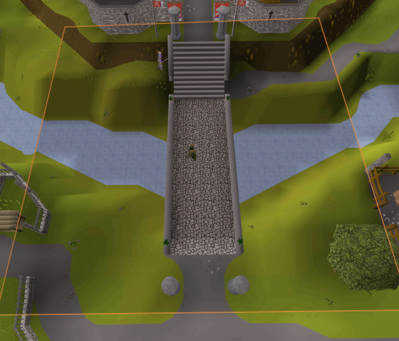

# Attack Ranges
A plugin for Runelite that produces an overlay showing a user's maximum attack range based on the weapon currently equip.

Contains support for Long-Range and Rapid/Accurate attack styles

Example of a user switching between Karil's Crossbow and the Runecrossbow, showing both Long-range and Rapid

