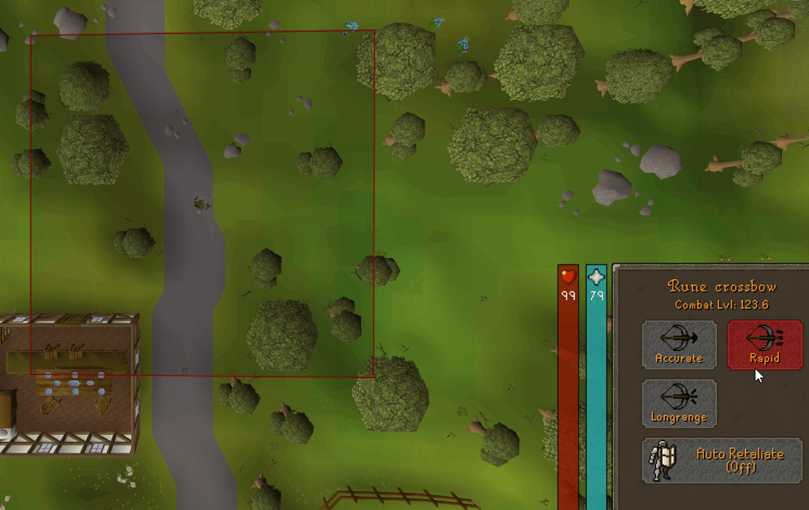

# Attack Ranges
A plugin for Runelite that produces an overlay showing a user's maximum attack range based on the weapon currently equipped.

Contains support for Long-Range and Rapid/Accurate attack styles

Example of user moving into range to attack

 

Example of a user switching between long-ranged and rapid

 

